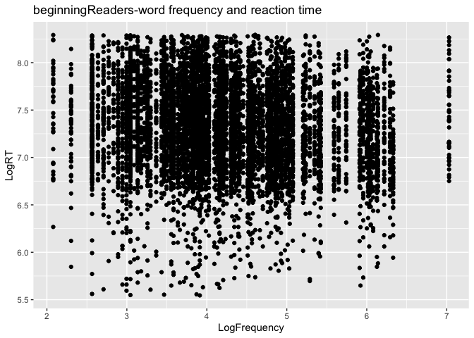
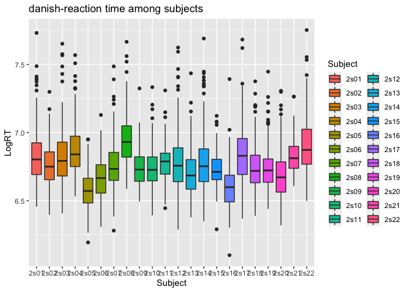
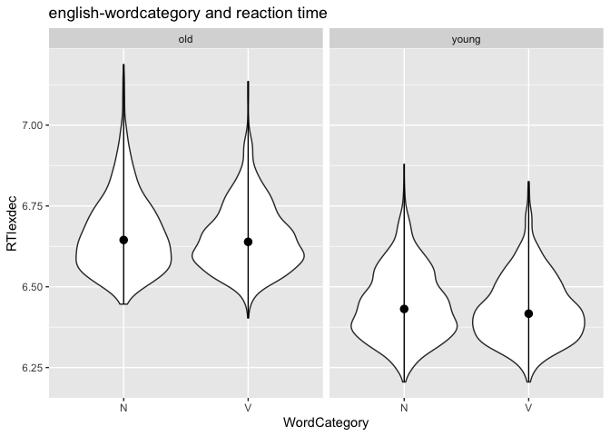

Programming assignment 2
================
Chaoyi Chen
Last update: 2021-02-10

**i. A bivariate scatterplot**

``` r
library(tidyverse)
```

    ## ── Attaching packages ─────────────────────────────────────── tidyverse 1.3.0 ──

    ## ✓ ggplot2 3.3.3     ✓ purrr   0.3.4
    ## ✓ tibble  3.0.5     ✓ dplyr   1.0.3
    ## ✓ tidyr   1.1.2     ✓ stringr 1.4.0
    ## ✓ readr   1.4.0     ✓ forcats 0.5.1

    ## ── Conflicts ────────────────────────────────────────── tidyverse_conflicts() ──
    ## x dplyr::filter() masks stats::filter()
    ## x dplyr::lag()    masks stats::lag()

``` r
library(languageR)
beginningReaders %>%
  ggplot(aes(x = LogFrequency, y = LogRT), size = 0.1) + # The original size of dots seems to be too big, so I found a code on the Internet to make it smaller.
  labs(title = "beginningReaders-word frequency and reaction time") + # I didn't find any part of the book about adding a title to a plot, so I found it on the internet
  geom_point()
```

<!-- -->

**ii. A boxplot with different fill colors**

``` r
danish %>%
  ggplot(aes(x = Subject, y = LogRT, fill = Subject)) +
  labs(title = "danish-reaction time among subjects") +
  geom_boxplot()
```

<!-- -->

**iii. A plot of your choice that includes a `stat_summary` and a
facet.**

``` r
english %>%
  ggplot(aes(x = WordCategory, y = RTlexdec)) +
  labs(title = "english-wordcategory and reaction time") +
  geom_violin() + # I don't know if I can still use boxplot for this question. Just in case, I made a last-minute change which turned a boxplot to a violin plot. They are almost the same but they count as differnt plots?
  facet_wrap(~AgeSubject) +
  stat_summary(mapping = aes(x = WordCategory, y = RTlexdec),fun.min = min, fun.max = max, fun = median)
```

<!-- -->
