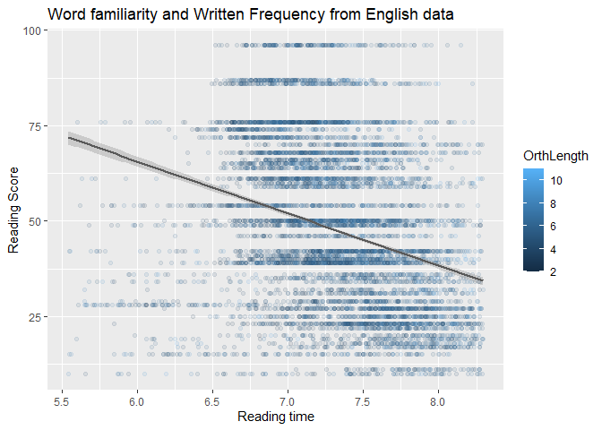
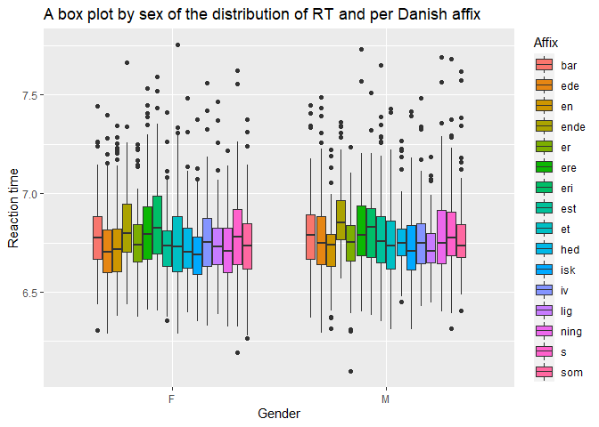
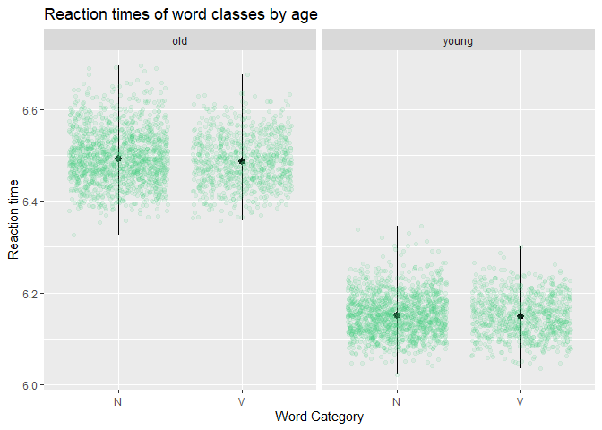

Programming assignment 2
================
Kyle Parrish
Last update: 2021-02-11

``` r
# Load libraries 
library(languageR)
library(tidyverse)
```

    ## -- Attaching packages --------------------------------------- tidyverse 1.3.0 --

    ## v ggplot2 3.3.2     v purrr   0.3.4
    ## v tibble  3.0.4     v dplyr   1.0.2
    ## v tidyr   1.1.2     v stringr 1.4.0
    ## v readr   1.4.0     v forcats 0.5.0

    ## -- Conflicts ------------------------------------------ tidyverse_conflicts() --
    ## x dplyr::filter() masks stats::filter()
    ## x dplyr::lag()    masks stats::lag()

``` r
# assign dfs to objects to familiarize myself
beginningReaders = beginningReaders
danish = danish
dativeSimplified = dativeSimplified
english = english 
spanishFunctionWords = spanishFunctionWords
```

``` r
#bivariate plot

ggplot(data = beginningReaders, aes(x = LogRT, y = ReadingScore, color = OrthLength)) + geom_point(alpha = .1) + geom_smooth(method = "lm", color = "grey35") + xlab("Reading time") + ylab("Reading Score") + ggtitle("Word familiarity and Written Frequency from English data")
```

    ## `geom_smooth()` using formula 'y ~ x'

<!-- -->

``` r
#boxplot

ggplot(data = danish, aes(x = Sex, y = LogRT, fill = Affix)) + geom_boxplot() + xlab("Gender") + ylab("Reaction time") + ggtitle("A box plot by sex of the distribution of RT and per Danish affix")
```

<!-- -->

``` r
#plot with stat summary and facet

ggplot(data = english) + stat_summary(mapping = aes(x = WordCategory, y = RTnaming), fun.min = min, fun.max = max, fun = median) + geom_jitter(data = english, aes(x = WordCategory, y = RTnaming), alpha = .1, color = "seagreen3") + facet_wrap(~ AgeSubject, nrow = 1)  + xlab("Word Category") + ylab("Reaction time") + ggtitle("Reaction times of word classes by age")
```

<!-- -->
